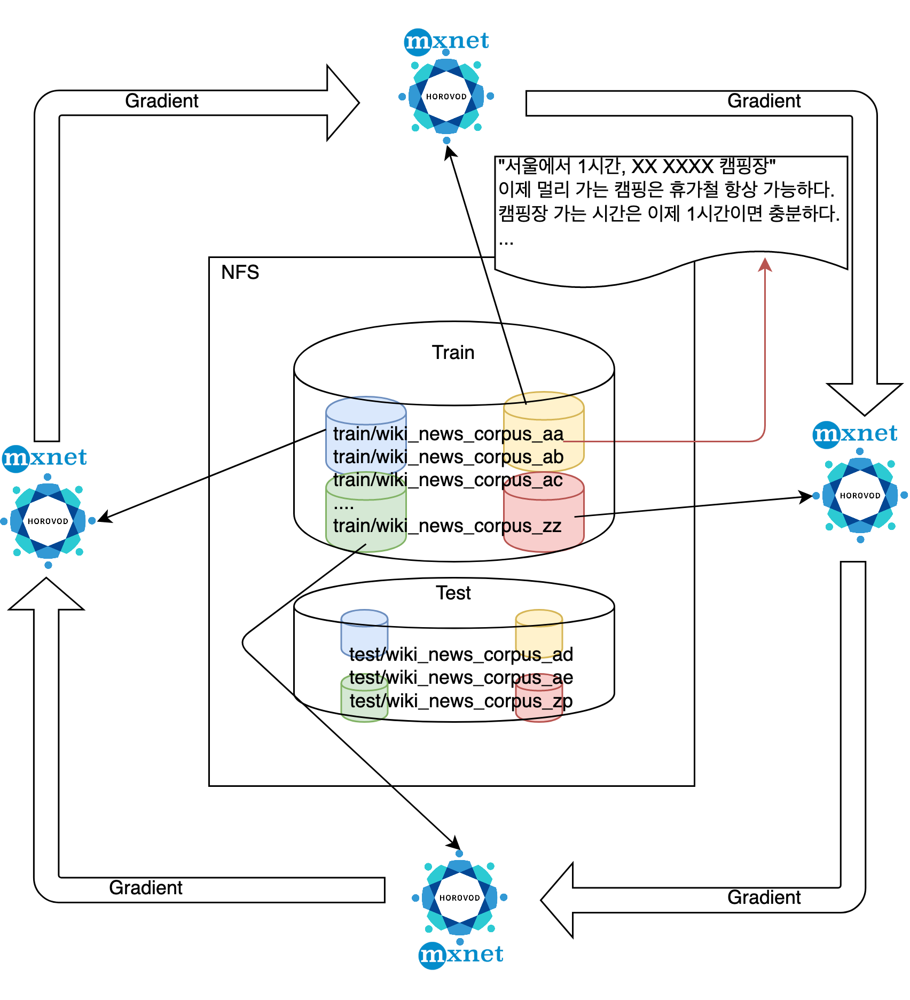
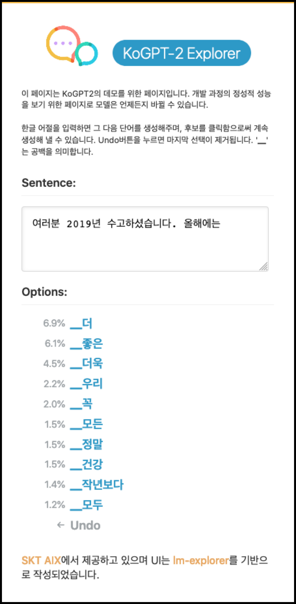

<!-- @import "[TOC]" {cmd="toc" depthFrom=1 depthTo=6 orderedList=false} -->

<!-- code_chunk_output -->

- [KoGPT2 (한국어 GPT-2)](#kogpt2-한국어-gpt-2)
  - [Why'?'](#why)
  - [Model](#model)
    - [Tokenizer](#tokenizer)
    - [Data](#data)
    - [Training](#training)
    - [How to install](#how-to-install)
      - [Requirements](#requirements)
  - [How to use](#how-to-use)
    - [PyTorch](#pytorch)
    - [MXNet-Gluon](#mxnet-gluon)
  - [How to deploy the pre-trained KoGPT-2 model to Amazon SageMaker](#how-to-deploy-the-pre-trained-kogpt-2-model-to-amazon-sagemaker)
  - [Demo](#demo)
  - [Subtask Evaluations](#subtask-evaluations)
  - [Examples](#examples)
  - [Contacts](#contacts)
  - [License](#license)

<!-- /code_chunk_output -->

---

## KoGPT2 (한국어 GPT-2)

### Why'?'

* OpenAI GPT-2 모델의 한국어 성능 한계

### Model

* `GPT-2 base` 모델

```python
GPT2Model(units=768,
    max_length=1024,
    num_heads=12,
    num_layers=12,
    dropout=0.1,
    vocab_size=50000)
```

* `Fused GELU`를 기반으로 10% 이상의 학습 및 추론 속도 향상

#### Tokenizer

* 2천 5백만 이상의 문장으로 학습(wiki + news)
* BPE(Byte Pair Encoding)
* 50,000 토큰

#### Data

| Data  |  # of Sentences  | # of Words |
|---|---|---|
| Korean Wiki  |  5M |  54M  |
| Korean News  |  120M | 1.6B |
| Other corpus |   9.4M, 18M | 88M, 82M |

* 원시 문장 (Raw text) 기준 약 20GB의 데이터 사용

#### Training


<table><tr><td>
    <center></center>
</td></tr>
</table>


- 이 작업은 아래 세 팀과의 협업으로 진행되었습니다.
  - `SKT Conv.AI`팀 : 대규모 언어모델 학습 로직 구현
  - `Amazon Machine Learning Solutions Lab`팀 : 대규모 분산 학습 인프라 구성
  - [`GluonNLP`](https://gluon-nlp.mxnet.io/)팀 : 학습 퍼포먼스 개선


#### How to install

```sh
git clone https://github.com/SKT-AI/KoGPT2.git
cd KoGPT2
pip install -r requirements.txt
pip install .
```


##### Requirements

* Python >= 3.6
* PyTorch == 1.5.0
* MXNet == 1.6.0
* onnxruntime == 1.5.2
* gluonnlp == 0.9.1
* sentencepiece >= 0.1.85
* transformers == 2.11.0

---

### How to use

####  PyTorch

* `2019년 한해를 보내며,`로 문장을 생성해내는 간단한 예제

```python
import torch
from kogpt2.pytorch_kogpt2 import get_pytorch_kogpt2_model
from gluonnlp.data import SentencepieceTokenizer
from kogpt2.utils import get_tokenizer

tok_path = get_tokenizer()
model, vocab = get_pytorch_kogpt2_model()
tok = SentencepieceTokenizer(tok_path,  num_best=0, alpha=0)
sent = '2019년 한해를 보내며,'
toked = tok(sent)
while 1:
  input_ids = torch.tensor([vocab[vocab.bos_token],]  + vocab[toked]).unsqueeze(0)
  pred = model(input_ids)[0]
  gen = vocab.to_tokens(torch.argmax(pred, axis=-1).squeeze().tolist())[-1]
  if gen == '</s>':
      break
  sent += gen.replace('▁', ' ')
  toked = tok(sent)
sent
```
```
'2019년 한해를 보내며, 새해에는 더 많은 사람들이 새해에 이루고자 하는 소망과 희망을 되새겨보는 시간이 되었으면 좋겠다.'
```

`model`은 디폴트로 `eval()`모드로 리턴됨, 따라서 학습 용도로 사용시 `model.train()`명령을 통해 학습 모드로 변경할 필요가 있다.

####  MXNet-Gluon


```python
import mxnet as mx
from kogpt2.mxnet_kogpt2 import get_mxnet_kogpt2_model
from gluonnlp.data import SentencepieceTokenizer
from kogpt2.utils import get_tokenizer

if mx.context.num_gpus() > 0:
  ctx = mx.gpu()
else:
  ctx = mx.cpu()

tok_path = get_tokenizer()
model, vocab = get_mxnet_kogpt2_model(ctx=ctx)
tok = SentencepieceTokenizer(tok_path, num_best=0, alpha=0)
sent = '2019년 한해를 보내며,'
toked = tok(sent)
while 1:
  input_ids = mx.nd.array([vocab[vocab.bos_token]]  + vocab[toked]).expand_dims(axis=0)
  pred = model(input_ids.as_in_context(ctx))[0]
  gen = vocab.to_tokens(mx.nd.argmax(pred, axis=-1).squeeze().astype('int').asnumpy().tolist())[-1]
  if gen == '</s>':
    break
  sent += gen.replace('▁', ' ')
  toked = tok(sent)
sent
```
```
'2019년 한해를 보내며, 새해에는 더 많은 사람들이 새해에 이루고자 하는 소망과 희망을 되새겨보는 시간이 되었으면 좋겠다.'
```

####  ONNX

```sh
python onnx/export_onnx_kogpt2.py
```

```python
import torch
import numpy as np
from kogpt2.pytorch_kogpt2 import get_pytorch_kogpt2_model
from gluonnlp.data import SentencepieceTokenizer
from kogpt2.utils import get_tokenizer
import onnxruntime

tok_path = get_tokenizer()
_, vocab = get_pytorch_kogpt2_model()
model = onnxruntime.InferenceSession("./onnx/pytorch_kogpt2_676e9bcfa7.onnx")
tok = SentencepieceTokenizer(tok_path,  num_best=0, alpha=0)
sent = '2019년 한해를 보내며,'
toked = tok(sent)

while 1:
  input_ids = torch.tensor([vocab[vocab.bos_token],]  + vocab[toked]).unsqueeze(0)
  pred = model.run(None, {'input_ids': np.array(input_ids)})[0]
  gen = vocab.to_tokens(torch.argmax(torch.tensor(pred), axis=-1).squeeze().tolist())[-1]
  if gen == '</s>':
      break
  sent += gen.replace('▁', ' ')
  toked = tok(sent)
sent
```
```
'2019년 한해를 보내며, 새해에는 더 많은 사람들이 새해에 이루고자 하는 소망과 희망을 되새겨보는 시간이 되었으면 좋겠다.'
```

### How to deploy the pre-trained KoGPT-2 model to Amazon SageMaker

Pre-trained 또는 fine-tuning KoGPT2 모델의 추론 API를 만드는 방법이 궁금하시면, AWS 한국 블로그 [Amazon SageMaker의 MXNet 추론 컨테이너를 활용한 KoGPT2 모델 배포하기](https://aws.amazon.com/ko/blogs/korea/deploy-kogpt2-model-mxnet-amazon-sagemaker/) 또는 [aws-samples Git repo](https://github.com/aws-samples/kogpt2-sagemaker)를 참고해주세요.

### Demo

**KoGPT2-Explorer**

<a href="http://52.231.69.211:8000" target="_blank">링크</a>


<table><tr><td>
    
</td></tr></table>

### Subtask Evaluations

**Sentimemt Analysis**

[NSMC 데이터](https://github.com/e9t/nsmc)

| Model | Test Accuracy |
|---|---|
| BERT base multilingual cased | 0.875 |
| [KoBERT](https://github.com/SKTBrain/KoBERT) |  0.901 |
| KoGPT2 |  0.899 |

**Paraphrase Detection**


[한국어 Paraphrase Detection 데이터](https://github.com/aisolab/nlp_classification/tree/master/BERT_pairwise_text_classification/qpair)


| Model | Test Accuracy |
|---|---|
| [KoBERT](https://github.com/aisolab/nlp_implementation) | 0.911 |
| KoGPT2 | 0.943 |

### Examples

- 한글 챗봇(chit-chat) 모델
  - https://github.com/haven-jeon/KoGPT2-chatbot
- 소설 쓰는 모델(NarrativeKoGPT2)
  - https://github.com/shbictai/narrativeKoGPT2
- 가사 쓰는 모델
  - https://github.com/gyunggyung/KoGPT2-FineTuning

### Contacts

`KoGPT2` 관련 이슈는 [이곳](https://github.com/SKT-AI/KoGPT2/issues)에 올려주세요.

### License

`KoGPT2`는 `modified MIT` 라이선스 하에 공개되어 있습니다. 모델 및 코드를 사용할 경우 라이선스 내용을 준수해주세요. 라이선스 전문은 `LICENSE` 파일에서 확인하실 수 있습니다.
