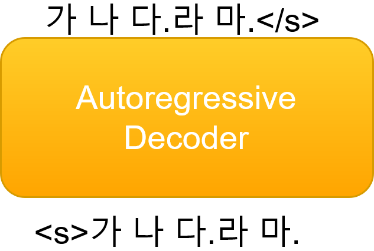
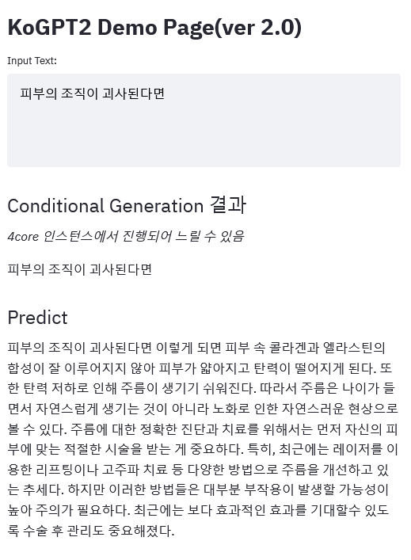

<!-- @import "[TOC]" {cmd="toc" depthFrom=1 depthTo=6 orderedList=false} -->

<!-- code_chunk_output -->

- [KoGPT2 (한국어 GPT-2) Ver 2.0](#kogpt2-한국어-gpt-2-ver-20)
  - [Tokenizer](#tokenizer)
  - [Model](#model)
    - [Performances](#performances)
    - [Classification or Regression](#classification-or-regression)
  - [Data](#data)
  - [Demo](#demo)
  - [Examples](#user-contributed-examples)
  - [Related press releases](#related-press-releases)
  - [Contacts](#contacts)
  - [License](#license)

<!-- /code_chunk_output -->


## KoGPT2 (한국어 GPT-2) Ver 2.0

[GPT-2](https://openai.com/blog/better-language-models/)는 주어진 텍스트의 다음 단어를 잘 예측할 수 있도록 학습된 언어모델이며 문장 생성에 최적화 되어 있습니다. `KoGPT2`는 부족한 한국어 성능을 극복하기 위해 40GB 이상의 텍스트로 학습된 한국어 디코더(`decoder`) 언어모델입니다. 

<table><tr><td>
    <center></center>
</td></tr>
</table>


### Tokenizer


[`tokenizers`](https://github.com/huggingface/tokenizers) 패키지의 `Character BPE tokenizer`로 학습되었습니다. 

사전 크기는 51,200 이며 대화에 자주 쓰이는 아래와 같은 이모티콘, 이모지 등을 추가하여 해당 토큰의 인식 능력을 올렸습니다. 
> 😀, 😁, 😆, 😅, 🤣, .. , `:-)`, `:)`, `-)`, `(-:`...

또한 `<unused0>` ~ `<unused99>`등의 미사용 토큰을 정의해 필요한 테스크에 따라 자유롭게 정의해 사용할 수 있게 했습니다.

```python
> from transformers import PreTrainedTokenizerFast
> tokenizer = PreTrainedTokenizerFast.from_pretrained("skt/kogpt2-base-v2",
  bos_token='</s>', eos_token='</s>', unk_token='<unk>',
  pad_token='<pad>', mask_token='<mask>') 
> tokenizer.tokenize("안녕하세요. 한국어 GPT-2 입니다.😤:)l^o")
['▁안녕', '하', '세', '요.', '▁한국어', '▁G', 'P', 'T', '-2', '▁입', '니다.', '😤', ':)', 'l^o']
```

### Model

| Model       |  # of params |   Type   | # of layers  | # of heads | ffn_dim | hidden_dims | 
|--------------|:----:|:-------:|--------:|--------:|--------:|--------------:|
| `kogpt2-base-v2` |  125M  |  Decoder |   12     | 12      | 3072    | 768 | 


```python
> import torch
> from transformers import GPT2LMHeadModel

> model = GPT2LMHeadModel.from_pretrained('skt/kogpt2-base-v2')
> text = '근육이 커지기 위해서는'
> input_ids = tokenizer.encode(text)
> gen_ids = model.generate(torch.tensor([input_ids]),
                           max_length=128,
                           repetition_penalty=2.0,
                           pad_token_id=tokenizer.pad_token_id,
                           eos_token_id=tokenizer.eos_token_id,
                           bos_token_id=tokenizer.bos_token_id,
                           use_cache=True)
> generated = tokenizer.decode(gen_ids[0,:].tolist())
> print(generated)
근육이 커지기 위해서는 무엇보다 규칙적인 생활습관이 중요하다.
특히, 아침식사는 단백질과 비타민이 풍부한 과일과 채소를 많이 섭취하는 것이 좋다.
또한 하루 30분 이상 충분한 수면을 취하는 것도 도움이 된다.
아침 식사를 거르지 않고 규칙적으로 운동을 하면 혈액순환에 도움을 줄 뿐만 아니라 신진대사를 촉진해 체내 노폐물을 배출하고 혈압을 낮춰준다.
운동은 하루에 10분 정도만 하는 게 좋으며 운동 후에는 반드시 스트레칭을 통해 근육량을 늘리고 유연성을 높여야 한다.
운동 후 바로 잠자리에 드는 것은 피해야 하며 특히 아침에 일어나면 몸이 피곤해지기 때문에 무리하게 움직이면 오히려 역효과가 날 수도 있다...
```

#### Performances

#### Classification or Regression

|   |  [NSMC](https://github.com/e9t/nsmc)(acc)  | [KorSTS](https://github.com/kakaobrain/KorNLUDatasets)(spearman) | PPL | 
|---|---|---|---|
| **KoGPT2 2.0**  | 93.3  | 78.4  | 24.6  |
| KoGPT2 1.0  | 89.9  | 80.1  | 45.4  |


### Data

[한국어 위키 백과](https://ko.wikipedia.org/) 이외, 뉴스, [모두의 말뭉치 v1.0](https://corpus.korean.go.kr/), [청와대 국민청원](https://github.com/akngs/petitions) 등의 다양한 데이터가 모델 학습에 사용되었습니다.


### Demo

[데모 링크](http://52.231.69.211:8080/)

<table><tr><td>
    <center></center>
</td></tr>
</table>


### User Contributed Examples


좋은 예제가 있으면 위 리스트에 추가해 [PR](https://github.com/SKT-AI/KoGPT2/pulls)을 올려 주시기 바랍니다. 

### Related press releases

- [SKT, 글 쓰는 AI 'KoGPT2' 새 버전 개발…문장→문단생성으로 성능 향상](https://www.ajunews.com/view/20210504120317549)
- [[AI 모델 탐험기] #7 한글 버전의 GPT-2, KoGPT2](https://medium.com/ai-networkkr/ai-%EB%AA%A8%EB%8D%B8-%ED%83%90%ED%97%98%EA%B8%B0-7-%ED%95%9C%EA%B8%80-%EB%B2%84%EC%A0%84%EC%9D%98-gpt-2-f7317e6499f9)

### Contacts

`KoGPT2` 관련 이슈는 [이곳](https://github.com/SKT-AI/KoGPT2/issues)에 올려주세요.


### License

`KoGPT2`는 [CC-BY-NC-SA 4.0 라이선스](https://creativecommons.org/licenses/by-nc-sa/4.0/) 하에 공개되어 있습니다. 모델 및 코드를 사용할 경우 라이선스 내용을 준수해주세요. 라이선스 전문은 [LICENSE](https://github.com/SKT-AI/KoGPT2/blob/master/LICENSE) 파일에서 확인하실 수 있습니다.
